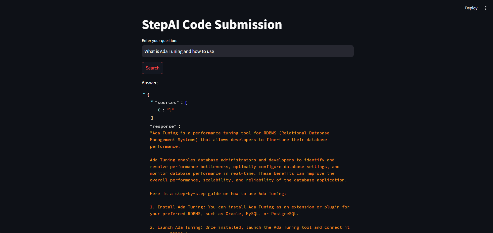

# Step AI Code Submission

Brief description of your project.

Code submitted by Aditya Pal Singh.
Mail id - adityapal0807@gmail.com



## Project Structure

- `semantic_chunk_splitter.py`: Python script for Semantic Chunking of scraped data.
  - Contains custom code for semantic chunking.

- `search.py`: Python script for question answering and retrieval.
  - Implements Hybrid retrieval methods (BM25 and BERT/bi-encoder).
  - Includes code for reranking of chunks.

- `app.py`: Streamlit web application for the project.

- `volumes/`: Folder for Docker volumes.

- `docker-compose.yml`: Docker Compose configuration file for Milvus database setup.

- `scrapper.py`: Python script for scraping data.

- `requirements.txt`: File listing Python dependencies required for the project. Include this file to install necessary libraries:
  ```bash
  pip install -r requirements.txt

## How to Run

1. **Initiate Milvus Database:**
   - Run Docker Compose to set up Milvus.
     ```bash
     docker-compose up
     ```

2. **Scrape Data (if needed):**
   - Run `scrapper.py` to scrape new links.
     ```bash
     python scrapper.py
     ```
   - Ensure the new collection name matches the name specified in `app.py`.

3. **Run Streamlit App:**
   - Launch the Streamlit web application.
     ```bash
     streamlit run app.py
     ```

## Additional Notes

- Provide any additional information or dependencies required for running the project.
- Include steps for environment setup, configuration, or any prerequisites.
